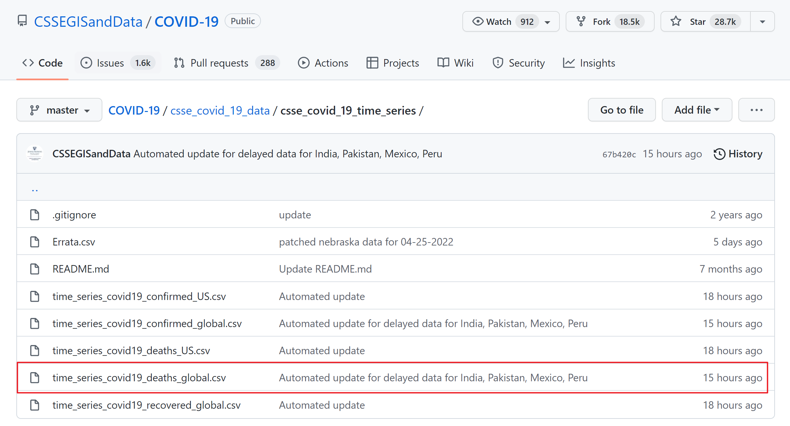

# Data sources

```{r,echo=FALSE, message=FALSE, results='hide', warning=F}
library(tidyverse)
COVID = read.csv('https://raw.githubusercontent.com/CSSEGISandData/COVID-19/master/csse_covid_19_data/csse_covid_19_time_series/time_series_covid19_deaths_global.csv')
GDP = read.csv("data/world_bank_gdp.csv")
Disaster <- readxl::read_xlsx("data/disaster data.xlsx")
```

## Disester Data

Our disaster Data is coming from [The International Disaster Data Center for research on the Epidemiology of Disaster](https://public.emdat.be/data). We downloaded the dataset with default setting. The web page is as shown below:


EM-DAT contains essential core data on the occurrence and effects of over 22,000 mass disasters worldwide from 1900 to the present day.

The source of the dataset is described as below, and hence high credibility.
> The database is compiled from various sources including UN, governmental and non-governmental agencies, insurance companies, research institutes and press agencies. As there can be conflicting information and figures, CRED has established a method of ranking these sources according to their ability to provide trustworthy and complete data. In the majority of cases, a disaster will only be entered into EM-DAT if at least two sources report the disaster's occurrence in terms of deaths and/or affected persons.

```{r}
sprintf('The row number of disaster dataset is %.0f, and the column number is %.0f.', dim(Disaster)[1], dim(Disaster)[2])
```
```{r}
# The Names including
print(colnames(Disaster))
```

## COVID Data

Our COVID data is from a [repository](https://github.com/CSSEGISandData/COVID-19/tree/master/csse_covid_19_data/csse_covid_19_time_series) from Johns Hopkins University Center for Systems Science and Engineering (JHU CSSE). We used only the deaths number and read the data directly from the repo.


The dataset also supported by the ESRI Living Atlas Team and the Johns Hopkins University Applied Physics Lab (JHU APL), and subject is read in from the daily case report. The time series tables are subject to be updated if inaccuracies are identified in our historical data.

```{r}
sprintf('The row number of covid dataset is %.0f, and the column number is %.0f.', dim(COVID)[1], dim(COVID)[2])
```

```{r}
# The Names including
print(colnames(COVID)[1:20])
# And all the later columns are time series data up to now. Each column represent the total death number up to that day.
```

## GDP Data

Our GDP data is downloaded from [The World Bank](https://datacatalog.worldbank.org/search/dataset/0037712/World-Development-Indicators). We used the world development indicators database, which is the primary World Bank collection of development indicators, compiled from officially recognized international sources. And it presents the most current and accurate global development data available, and includes national, regional and global estimates.


As shown above, we include all Countries and Time(Years) available, and GDP is what we need.

```{r}
sprintf('The row number of GDP dataset is %.0f, and the column number is %.0f.', dim(GDP)[1], dim(GDP)[2])
```

```{r}
# The Names including
print(colnames(GDP)[1:20])
# And all the later columns are time series data up to now.
```


