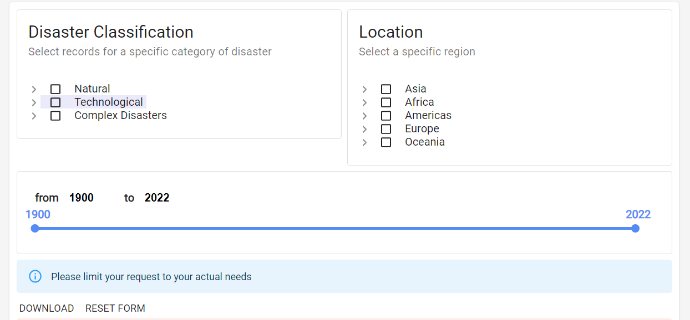
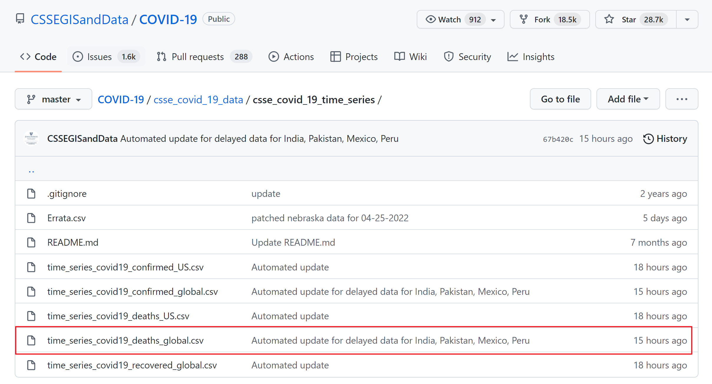
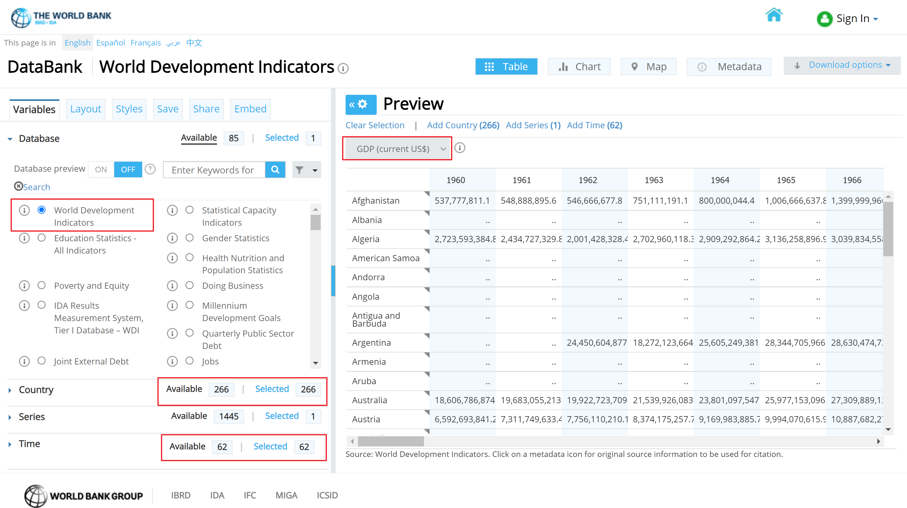

--- 
title: "Disaster Analysis"
author: 
  - Jiachen Liu
  - Hao Chang
  - Yihui Xie
date: "`r Sys.Date()`"
site: bookdown::bookdown_site
---

# Introduction

As the pandemic grow rapidly after 2020 and developed a kind of stable pattern nowadays, it has a great influence on the human livings and other activities. Actually this is not the only disaster that had a great influence on humans' live. There are several big disaster that are greatly recorded in the history. For example, the Valdivia Earthquake Strikes Chile, the Chernobyl nuclear disaster, the Indian Ocean Tsunami etc. They've all made a big damage on humans' life as well as economic.

We are interested in the disaster damage pattern in different region and different time. Is there any clustering patterns? Is there a inside seasonal pattern? Is there any relation between different disasters? These are all questions that researchers are interested in. We want to use data visualization method to have an intuitive understanding of these patterns.

Also, as we want to know more about the pattern of Covid-19, for we can know about the real world based on this, we also want to compare the Covid-19 pattern and other disaster. It might give us a internal understanding of nowadays pandemic.


<!--chapter:end:index.Rmd-->

# Data sources

```{r,echo=FALSE, message=FALSE, results='hide', warning=F}
library(tidyverse)
COVID = read.csv('https://raw.githubusercontent.com/CSSEGISandData/COVID-19/master/csse_covid_19_data/csse_covid_19_time_series/time_series_covid19_deaths_global.csv')
GDP = read.csv("data/world_bank_gdp.csv")
Disaster <- readxl::read_xlsx("data/disaster data.xlsx")
```

## Disester Data

Our disaster Data is coming from [The International Disaster Data Center for research on the Epidemiology of Disaster](https://public.emdat.be/data). We downloaded the dataset with default setting. The web page is as shown below:



EM-DAT contains essential core data on the occurrence and effects of over 22,000 mass disasters worldwide from 1900 to the present day.

The source of the dataset is described as below, and hence high credibility.
> The database is compiled from various sources including UN, governmental and non-governmental agencies, insurance companies, research institutes and press agencies. As there can be conflicting information and figures, CRED has established a method of ranking these sources according to their ability to provide trustworthy and complete data. In the majority of cases, a disaster will only be entered into EM-DAT if at least two sources report the disaster's occurrence in terms of deaths and/or affected persons.

```{r}
sprintf('The row number of disaster dataset is %.0f, and the column number is %.0f.', dim(Disaster)[1], dim(Disaster)[2])
```
```{r}
# The Names including
print(colnames(Disaster))
```

## COVID Data

Our COVID data is from a [repository](https://github.com/CSSEGISandData/COVID-19/tree/master/csse_covid_19_data/csse_covid_19_time_series) from Johns Hopkins University Center for Systems Science and Engineering (JHU CSSE). We used only the deaths number and read the data directly from the repo.


The dataset also supported by the ESRI Living Atlas Team and the Johns Hopkins University Applied Physics Lab (JHU APL), and subject is read in from the daily case report. The time series tables are subject to be updated if inaccuracies are identified in our historical data.

```{r}
sprintf('The row number of covid dataset is %.0f, and the column number is %.0f.', dim(COVID)[1], dim(COVID)[2])
```

```{r}
# The Names including
print(colnames(COVID)[1:20])
# And all the later columns are time series data up to now. Each column represent the total death number up to that day.
```

## GDP Data

Our GDP data is downloaded from [The World Bank](https://datacatalog.worldbank.org/search/dataset/0037712/World-Development-Indicators). We used the world development indicators database, which is the primary World Bank collection of development indicators, compiled from officially recognized international sources. And it presents the most current and accurate global development data available, and includes national, regional and global estimates.


As shown above, we include all Countries and Time(Years) available, and GDP is what we need.

```{r}
sprintf('The row number of GDP dataset is %.0f, and the column number is %.0f.', dim(GDP)[1], dim(GDP)[2])
```

```{r}
# The Names including
print(colnames(GDP)[1:20])
# And all the later columns are time series data up to now.
```


<!--chapter:end:02-data.Rmd-->

# Data transformation

```{r,echo=FALSE, message=FALSE, results='hide'}
library(tidyverse)
library(countrycode)
```

## Disaster Data

```{r,results='hide', warning=FALSE, message=FALSE}
# Load disaster data and map message data
raw_data <- readxl::read_xlsx("data/emdat_public_2022_04_30_full.xlsx")
latitude.longtitude.data <- map_data("world")
```

We want to add location information to disaster data for graphical visualization. However, due to the large time span of our data, some countries have experienced splitting or merging in this 100-year period, so in order to ensure that our data can be merged with the data of geographic information through the country name, we need to clean our countries' names first before doing the merge.

### checking the country name

```{r, eval=FALSE}
# Apply the countryname function to standardize the countryname of each dataset
countryname(unique(raw_data$Country))
countryname(unique(latitude.longtitude.data$region))
```

`Warning in countrycode_convert(sourcevar = sourcevar, origin = origin, destination = dest,  :`
  `Some values were not matched unambiguously: Azores Islands, Canary Is, Serbia Montenegro, Yemen P Dem Rep`

`Warning in countrycode_convert(sourcevar = sourcevar, origin = origin, destination = dest,  :`
  `Some values were not matched unambiguously: Ascension Island, Azores, Barbuda, Canary Islands, Chagos Archipelago, Grenadines, Heard Island, Madeira Islands, Micronesia, Saba, Saint Martin, Siachen Glacier, Sint Eustatius, Virgin Islands`

There are several reasons for mismatching:  

* First situation, the countries are too small to be included in the package.(e.g. "Tuvalu", "Micronesia (Federated States of)")
* Second situation, the countries are no longer exist since our data contains data from 1900. (e.g. "Serbia Montenegro", "Yemen P Dem Rep")
  + "Yemen P Dem Rep" merged with "Yemen Arab Rep" in 1990 and is called "Yemen" now.
* Third situation, this does not show up here, but we need to consider the situation that some of the countries disintegrated during the past 122 years. (e.g. "Czechoslovakia", "Yugoslavia") In this situation, we may need to change the data of one country into several. 
  + "Serbia Montenegro" split into two countries called "Serbia" and "Montengro" in 2006. 
  + "Yugoslavia" had split into six countries,"Slovenia","Croatia", "Serbia", "Montengro", "Bosnia and Herzegovina" and "Macedonia". 
  + "Czechoslovakia" had split into two countries, "Czech Republic" and "Slovakia", in 1993.

### Manual Adjustments

Based on the above three situation, we did some manual adjustment(splitting) on our data, and reread in the data.   
Our splited countries are："Czechoslovakia"， "Yugoslavia"，and “Serbia Montenegro”.

```{r, warning=FALSE, message=FALSE}
# data after splitting certain countries
data_temp <- readxl::read_xlsx("data/disaster data.xlsx") 

# some manual adjustments

# delete "Micronesia (Federated States of)" and "Tuvalu", which does not included in the existing data, hence do not have latitude and longitude information.
data_remove <- data_temp[-which(data_temp$Country %in% c("Micronesia (Federated States of)","Tuvalu")),]
# manual match some small contries: Azores Islands - Azores; Canary Is - Canary Islands
data_remove$Country[data_remove$Country == "Azores Islands"] <- "Azores"
data_remove$Country[data_remove$Country == "Canary Is"] <- "Canary Islands"
# merge "Yemen P Dem Rep" and "Yemen Arab Rep"
data_remove$Country[data_remove$Country %in% c("Yemen P Dem Rep","Yemen Arab Rep")] <- "Yemen"
# Virgin Islands are one area in existing data, so merge together: Virgin Island (British) & Virgin Island (U.S.) - Virgin Islands
data_remove$Country[data_remove$Country == "Virgin Island (British)"] <- "Virgin Islands"
data_remove$Country[data_remove$Country == "Virgin Island (U.S.)"] <- "Virgin Islands"
# "Hong Kong" and "Macao" belong to China now
data_remove$Country[data_remove$Country == "Hong Kong"] <- "China"
data_remove$Country[data_remove$Country == "Macao"] <- "China"
# "Netherlands Antilles" belongs to "Caribbean Netherlands", but does not have independent geographic information, so including it in "Netherlands"
data_remove$Country[data_remove$Country == "Netherlands Antilles"] <- "Netherlands"
# same situation, including "Saint Martin (French part)" in "Saint Martin"
data_remove$Country[data_remove$Country == "Saint Martin (French Part)"] <- "Saint Martin"
# "Tokelau" is belong to "New Zealand"
data_remove$Country[data_remove$Country == "Tokelau"] <- "New Zealand"

# Replace the column "Country" with the standard country names, and when mismatch then the country must be one of our adjusted countries, so just keep it as it is.
disaster_match <- data_remove %>%
  mutate(Country = ifelse(is.na(countryname(data_remove$Country)),data_remove$Country,countryname(data_remove$Country)))

#The data frame has a total of 50 variables, but we won't use all of them, so we need to tidy the data.
disaster <- disaster_match %>%
  select("Year","Disaster Group","Disaster Subgroup","Disaster Type","Disaster Subtype","Country","ISO","Region",
         "Continent","Total Deaths","Total Damages ('000 US$)","Total Damages, Adjusted ('000 US$)")

colnames(disaster) <- c("Year","Disaster Group","Disaster Subgroup","Disaster Type","Disaster Subtype","Country","ISO","Region","Continent","Total Deaths","Total Damages","Total Damages Adjusted")
```

## Covid Data

The number of deaths in this data is refreshed daily in the last column and is cumulative so we only need to keep the last column for the number of deaths in each country. Because some countries count the number of deaths according to different cities, we need to add up the number of deaths in different cities in each country and combine them into the total number of deaths in a country.

```{r}
#Loading covid data
df_covid_raw = read.csv('https://raw.githubusercontent.com/CSSEGISandData/COVID-19/master/csse_covid_19_data/csse_covid_19_time_series/time_series_covid19_deaths_global.csv')
covid_df = df_covid_raw %>% select(ncol(df_covid_raw)) 
covid_df = cbind("Country.Region" = df_covid_raw$Country.Region, 
                 "Total.Death" = rowSums(covid_df)) %>% data.frame()
covid_df = covid_df %>% mutate("Total.Death" = as.numeric(Total.Death)) %>% 
  group_by(Country.Region) %>% 
  summarise("Total.Death" = sum(Total.Death, na.rm = T))
```

In order to compare the data together, we also need to unify the country names of the data according to the corrected disaster data.

```{r, eval=FALSE}
#Apply the countryname function to standardize the countryname of dataset
countryname(unique(covid_df$Country.Region))
```

`Warning in countrycode_convert(sourcevar = sourcevar, origin = origin, destination = dest,  :`
  `Some values were not matched unambiguously: Diamond Princess, Micronesia, MS Zaandam, Summer Olympics 2020, Winter Olympics 2022`
  
```{r}
# remove Summer Olympics 2020 & Winter Olympics 2022,Micronesia
covid_remove <- covid_df[-which(covid_df$Country.Region %in% c("Summer Olympics 2020", "Winter Olympics 2022", "Micronesia")),]
# Diamond Princess is a Japanese cruise ship, so it counts as Japan
covid_remove$Country.Region[covid_remove$Country.Region == "Diamond Princess"] <- "Japan"
# MS Zaandam is a Netherlands cruise ship, so it counts as Netherlands
covid_remove$Country.Region[covid_remove$Country.Region == "MS Zaandam"] <- "Netherlands"

# adding a column called "country.name" to be the standard country names, and when mismatch then the country must be one of our adjusted countries, so just keep it as it is.
covid_match <- covid_remove %>%
  mutate(country.name = ifelse(is.na(countryname(covid_remove$Country.Region)),covid_remove$Country.Region,countryname(covid_remove$Country.Region)))
```

## GDP time series data

```{r,eval=FALSE}
# Load the GDP raw data
GDP_temp = read.csv("data/world_bank_gdp.csv")
```

The country name of this data set contains two parts, which is the names of difference countries and different regions. We only consider about the time series data of the country so we delete the country name of different regions. Also, the name of time series variables is not beautiful so we also change the variable name that makes it look more properly.

```{r,eval=FALSE}
# We only need the country name, country code and time series data
GDP <- GDP_temp[c(1:which(GDP$Country.Name == "Zimbabwe")),-c(1,2)]
```

The missing value of this data is not represented by NULL or NA, but by "..". This is not convenient for our subsequent data reference and processing, so we directly use Excel to convert all ".." into NULL.

```{r,results='hide', warning=FALSE, message=FALSE}
# Load the GDP with missing value expressed by NULL
GDP = read.csv("data/GDP.csv")
```

We want to add a location information to this data so we need to unify the country names.

```{r}
GDP <- GDP %>%
  mutate(Country.Name = ifelse(is.na(countryname(GDP$Country.Name)),GDP$Country.Name,countryname(GDP$Country.Name)))
```

## latitude longtitude data

Although the country name of this data is sufficiently standardized, in order for all the data to match each other, we also need to modify the country name.

```{r,results='hide', warning=FALSE, message=FALSE}
# Load the data
latitude.longtitude.data <- map_data("world")

# # adding a column called "Country" to be the standard country names, and when mismatch then the country must be one of our adjusted countries, so just keep it as it is.
map_match <- latitude.longtitude.data %>%
  mutate(Country = ifelse(is.na(countryname(latitude.longtitude.data$region)),latitude.longtitude.data$region,countryname(latitude.longtitude.data$region))) %>% 
  select(long,lat,group,order,Country,subregion)
```


<!--chapter:end:03-cleaning.Rmd-->

# Missing values

```{r, message=F, echo=F, warning=F}
library(readxl)
library(redav)
library(tidyverse)
library(mi)
library(sf)
library(tmap)
library(zoo)
```


## Disaster dataset

```{r}
disaster = read.csv("data/disaster_missing.csv") %>%
  select(-X)
```


### By row

```{r}
rowSums(is.na(disaster)) %>%
  sort(decreasing = TRUE) %>%
  table()
```
It shows that the missing value numbers with different rows. There are for 3555 rows with no missing values, 1748 rows with 1 missing values, 14669 rows with 2 missing values, 4781 rows with 3 missing values and 742 rows with 4 missing values.

Also we want to visualize it by year.
```{r}
missing <- disaster %>% 
    group_by(Year) %>% 
    summarise(sum.na = sum(is.na(Total.Deaths)+is.na(Total.Damages)+is.na(Disaster.Subtype)+is.na(Total.Damages.Adjusted)))

ggplot(missing, aes(x = Year, y = sum.na)) +
  geom_col(color = "blue", fill = "lightblue") +
  ggtitle("Number of missing values by Year") +
  xlab("") +
  ylab("Number of missing station values(All Variables)") +
  theme(axis.text.x = element_text(angle = 45)) +
  scale_x_discrete(breaks = c('1900','1910','1920','1930','1940','1950','1960','1970','1980','1990','2000','2010','2020'))
```

It shows that the missing value has a increasing trend among all years because the data records are increasing over year.

### By Column

```{r, fig.width=17, fig.height=7}
colSums(is.na(disaster)) %>%
  sort(decreasing = TRUE)

plot_missing(disaster, percent = FALSE)
```

It shows that damage and adj.damage gets the most nas, then deaths and subtype.

### By Value

```{r}
tidydata <- disaster %>% 
    rownames_to_column("id") %>% 
    gather(key, value, -id) %>% 
    mutate(missing = ifelse(is.na(value), "yes", "no"))

ggplot(tidydata, aes(x = key, y = fct_rev(id), fill = missing)) +
  geom_tile() + 
  ggtitle("ourdata with NAs") +
  scale_fill_viridis_d() + # discrete scale
  theme_bw()+
  scale_y_discrete(breaks = c())
```

It gives a look at the na for each value. However I don't think that there is a relation between the nas in different variable.


## Covid Dataset

```{r}
covid = read.csv("data/covid.csv") %>%
  select(-X)
```

```{r}
sum(is.na(covid))
```

There is no NA value in this data set.

## GDP Dataset
```{r}
GDP = read.csv("data/GDP.csv")
```

This is a time series data from 1960 to 2020 for the countries around the world, we want to check the na for each countries and for each Year.

### For countries
We want to see how many NA are there for each country
```{r}
missing = cbind(GDP[,1:2], NAs = rowSums(matrix(as.numeric(is.na(GDP[,-c(1,2)])), nrow = nrow(GDP)))) %>%
  arrange(desc(NAs))

head(missing, 10)
```

As we can see, the missing value are tend to appear on those small countries where data are hard to collect.

### For Year
Now we want to know the missing value among time
```{r}
missing = cbind(Year = 1960:2020, NAs = colSums(matrix(as.numeric(is.na(GDP[,-c(1,2)])), nrow = nrow(GDP))))

plot(missing, main = 'Missing values among year')
```

Here as we can see, the missing values are reducing with the year increase. That's because with the development of the technology, we have more and easier access to collect the data.


<!--chapter:end:04-missing.Rmd-->

# Results

```{r, message=FALSE, echo=FALSE, results='hide'}
library(tidyverse)
<<<<<<< HEAD
```

## COVID Data Exploration

```{r, message=FALSE}
df_covid = read.csv("data/covid.csv") %>% select(-X)
summary(df_covid)
```

### Cleveland Dot Plot

```{r, fig.height=8, fig.width=6}
df_covid %>% arrange(desc(Total.Death)) %>% head(50) %>% 
   mutate("Country.Region" = fct_reorder(Country.Region, Total.Death)) %>% 
  ggplot(aes(x = Total.Death, y = Country.Region)) + 
  geom_point(color = "#D75D47", size = 2) +
  labs(title = 'COVID-19 Cumulative Death of Countries',
       y = '', x = "Total Death")
```

### Heatmap

```{r}
df_map = read.csv("data/Location.csv")
df_covid %>% left_join(df_map, 
                       by = c("Country.Region" = "Country")) %>% 
  ggplot(aes(x = long, y = lat, group = group, text = Country.Region)) +
  geom_polygon(aes(fill = Total.Death), color = "#AAABAC") + 
  scale_fill_gradient(low = "#FBD588", high = "#F55536") +
  labs(title = "COVID-19 Cumulative Death World Heatmap",
       fill = "Total Death", x = "", y = "")
  
```


<!--chapter:end:05-results.Rmd-->

# Interactive component
```{r, message=F, echo=F, warning=F}
library(tidyverse) 
=======
library(ggrepel)
library(GGally)
library(parcoords)
>>>>>>> ea106207e297e1b29b88bc72897364554b54487e
library(maps)
library(readxl)
library(gganimate)
library(gifski)
library(plotly)
library(countrycode)
<<<<<<< HEAD
```

=======
library(zoo)
library(forecast)
library(cowplot)

disaster <- read.csv("data/disaster.csv")
```

## Disaster Data Exploration

### Analysis of the relationship between number of disaster, Deaths and Damages

In this section, we want to study the relationship between death and property damage and the number of disasters. We group and integrate the data according to the Disaster.Type in the data. Then do bar plot with Disaster.Type and sort from large to small for the number of disasters, the number of deaths and property damage.

```{r,fig.height=10,fig.width=7}
plot.data1 <- disaster %>%
  select(Disaster.Type,Total.Deaths,Total.Damages.Adjusted,Disaster.Group)%>%
  group_by(Disaster.Group,Disaster.Type) %>%
  summarize(Death = sum(Total.Deaths),Damages = sum(Total.Damages.Adjusted),Num.disaster = length(Total.Deaths)) %>%
  ungroup()

plot1.1 <- plot.data1 %>%
  mutate(Disaster.Type = fct_reorder(Disaster.Type, Num.disaster)) %>%
  ggplot(aes(x=Disaster.Type, y=Num.disaster)) +
    geom_bar(stat="identity", width=.4) +
    coord_flip() +
    xlab("") +
    theme(axis.title.x=element_blank(),plot.margin = unit(c(1.5,1.5,1.5,1.5), "lines"))

plot1.2 <- plot.data1 %>%
  mutate(Disaster.Type = fct_reorder(Disaster.Type, Death)) %>%
  ggplot( aes(x=Disaster.Type, y=Death)) +
    geom_bar(stat="identity", width=.4) +
    coord_flip() +
    xlab("") +
    theme(axis.title.x=element_blank(),plot.margin = unit(c(1.5,1.5,1.5,1.5), "lines"))

plot1.3 <- plot.data1 %>%
  mutate(Disaster.Type = fct_reorder(Disaster.Type, Damages)) %>%
  ggplot(aes(x=Disaster.Type, y=Damages)) +
    geom_bar(stat="identity", width=.4) +
    coord_flip() +
    xlab("") +
    theme(axis.title.x=element_blank(),plot.margin = unit(c(1.5,1.5,1.5,1.5), "lines"))

plot_grid(plot1.1,plot1.2,plot1.3,ncol = 1,align = "hv",labels = c("Disaster frequency over Countries (plot 1)","Disaster Deaths over Countries (plot 2)","Disaster Damages over Countries (plot 3)"),hjust = -0.5,vjust =1.2)
```

The plot 1 is a bar plot of the frequency of disasters. We can see that there are three orders of magnitude for the number of disasters. The first magnitude exceeded the other disasters by more than three times, and they were "Transport accident", "Flood" and "Storm". There are four kinds of disasters in the second magnitude, the values between them are very similar and more than twice the number of remaining disasters, they are earthquake, industrial accident, miscellaneous accident and epidemic. There are 12 catastrophes in the last magnitude, all of which occur relatively infrequently.

The plot2 is a bar chart of the number of deaths caused by a disaster. We can see that there are many disasters with very few or even zero deaths, so we only observed six disasters with significant numbers. They are Drought, Epidemic, Flood, Complex Disaster, Earthquake and Storm. Comparing the plot1 disaster frequency chart, we will find that the above five disasters do not completely belong to the first two orders of magnitude, and the frequency of complex disasters and droughts is actually much lower than that of the other three disasters. So we can think that deaths are not completely positively correlated with the frequency of disasters

The figure above is a bar chart of economic losses caused by a disaster. We can see that there are many disasters with little or no economic loss, so we only observed three very significant disasters and four relatively significant disasters. Very notable disasters are storms, floods and earthquakes. Relatively notable disasters are droughts, wildfires, extreme temperatures, and industrial accidents. Comparing to the plot2 disaster death map, we will find that except for floods and earthquakes, disasters that cause a large number of deaths are not necessarily accompanied by high economic losses. Comparing the plot1 disaster frequency map, we will find that floods, storms, earthquakes and industrial accidents are indeed frequent disasters, and most of these disasters that cause high economic losses are natural disasters.

```{r}
cols <- character(nrow(plot.data1))
cols[] <- "black"

cols[plot.data1$Disaster.Group == "Natural"] <- "blue"
cols[plot.data1$Disaster.Group == "Technological"] <- "red"
cols[plot.data1$Disaster.Group == "Complex Disasters"] <- "orange"
```

```{r}
plot.data1.1 <- plot.data1 %>%
  select(Disaster.Group,Death,Damages,Num.disaster) %>%
  group_by(Disaster.Group) %>%
  mutate(Death = log10(Death),Damages = log10(Damages),'Disaster Frequency' = log10(Num.disaster)) %>%
  ungroup()

pairs(plot.data1.1[,c(2,3,5)],main = "Correlation Scatterplot",col=cols,pch=19)
```

In order to further verify the relationship between disaster frequency and death and economic loss, we have drawn a pairwise plot, in which blue points represent natural disasters, red points represent technological disasters, and orange points represent complex disasters. . Through this figure, we can find that there is a certain correlation trend among the frequency of disasters, deaths and economic losses.

```{r}
target.Country = c('China','US','Russia','India','Brazil','Japan','France','Italy','South Africa','Egypt')

plot.data2 <- disaster %>%
  filter(Country %in% target.Country) %>%
  filter(Disaster.Group %in% c("Natural","Technological")) %>%
  group_by(Country,Disaster.Group) %>%
  summarize(Death = log(sum(Total.Deaths)),Damages = log(sum(Total.Damages.Adjusted)),'Disaster Frequency' = log(length(Total.Deaths)))

colnames(plot.data2) <- c("Country","Disaster Group","Death","Damages","Disaster Frequency")

parcoords(plot.data2,
          color = list(
            colorBy = "Disaster Group",
            colorScale = "scaleOrdinal",
            colorScheme = "schemeCategory10"),
          rownames = F,
          brushMode = "1D-axes",
          reorderable = T,
          queue = T,
          withD3 = T)

```

To further verify our conclusions, we selected ten typical countries for further analysis, they are "China', 'US', 'Russia', 'India', 'Brazil', 'Japan', 'France', ' Italy', 'South Africa' and 'Egypt'. Among them, we choose "China', 'US', 'Russia', 'India', 'Japan', 'France', 'Italy' because these countries are relatively significant points in the previous scatter plot analysis. The choice of 'South Africa' and 'Egypt' is because South America and Africa are vast and have large populations, so we selected the countries that are representative of the continent for analysis.

We calculated deaths, economic losses and disaster frequencies for these ten typical countries according to different types of disasters and used these data to make interactive parallel coordinates plots. Through the above figure, we can find that there are certain clusters of deaths caused by technological disasters , and the deaths caused by natural disasters are very scattered. Moreover, the economic losses caused by technological disasters are often smaller than those caused by natural disasters. We think this may be related to the fact that technological disasters are generally smaller in scale than natural disasters.

>>>>>>> ea106207e297e1b29b88bc72897364554b54487e
```{r}
disaster = read.csv('data/disaster.csv') %>%
  select(-X)

mapdata = read.csv('data/Location.csv') %>%
  select(-X)
```

```{r}
disaster_raw = disaster %>%
  group_by(Year,Country) %>%
  summarize(deaths = sum(Total.Deaths, na.rm = T),
            damage = sum(Total.Damages, na.rm = T),
            damageadj = sum(Total.Damages.Adjusted, na.rm = T)) %>%
  unique()
```

```{r}
country = sort(unique(mapdata$Country))
data = data.frame(Year = as.character(rep(seq(1900,2022), each = length(country))), Country = rep(country, 123))
data$Year = as.numeric(data$Year)
data1 = data %>% left_join(disaster_raw)
data1[is.na(data1)] = 0

rawdata = left_join(mapdata,data1,by=c("Country" = "Country"))
rawdata$Year = as.numeric(rawdata$Year)
```

```{r}
g2 = ggplot(rawdata, aes(x = long, y = lat, group = group))+ 
  # the same as the setting with summary plot
  geom_polygon(aes(fill = log10(deaths)), color = 'black')+
  transition_manual(frames = Year) +
  # use year as the animation parameter
  scale_fill_gradient(low = '#FFF68F',high = '#FC4902') +
  labs(title = paste('Year:','{current_frame}')) +
  # make the title changes among different plot
  ggdark::dark_theme_bw()

animate(g2,fps = 3)
```

```{r}
g3 = ggplot(rawdata, aes(x = long, y = lat, group = group))+ 
  # the same as the setting with summary plot
  geom_polygon(aes(fill = log10(damageadj)), color = 'black')+
  transition_manual(frames = Year) +
  # use year as the animation parameter
  scale_fill_gradient(low = '#FFF68F',high = '#FC4902') +
  labs(title = paste('Year:','{current_frame}')) +
  # make the title changes among different plot
  ggdark::dark_theme_bw()

animate(g3,fps = 3)
```

<<<<<<< HEAD

# Interactive Display
Here we construct a shiny interactive plot to show the Year pattern of GDP, Damage and Deaths on the world map. We can see the geographical patterns by using it.
https://howardch.shinyapps.io/Shiny/

<!--chapter:end:06-interactive.Rmd-->

# Conclusion


<!--chapter:end:07-conclusion.Rmd-->

---
title: "Result - disaster"
author: "Yihui Xie"
date: "5/2/2022"
output: html_document
---

# result - disaster

```{r,echo=FALSE, message=FALSE, results='hide'}
library(ggplot2)
library(tidyverse)
library(ggrepel)
library(cowplot)
library(GGally)
library(parcoords)

disaster <- read.csv("data/disaster.csv")
```

## Analysis of the relationship between death and economic loss

```{r,warning=FALSE,warning=FALSE, message=FALSE,fig.width=10}
plot.data1 <- disaster %>%
=======
Here, These two animations are a display of Death and Damage log pattern through different year. We can see that For Death data, It first appears to be large in Asia in the beginning of 20th century, and the from the late 20th century the number growth in Africa and South America. However, the damage shows the different pattern. It first appeared in America but then in late 20th century the damage in Asia(especially in China and India) become larger.

### Analysis of the relationship between death and economic loss

```{r,warning=FALSE,warning=FALSE, message=FALSE,fig.width=10,fig.height=7}
plot.data3 <- disaster %>%
>>>>>>> ea106207e297e1b29b88bc72897364554b54487e
  select(Country,Total.Deaths,Total.Damages.Adjusted,Continent) %>%
  group_by(Country) %>%
  summarize(Deaths = sum(Total.Deaths),Adjusted.Damages = sum(Total.Damages.Adjusted),
            disaster.Num =length(Total.Deaths),Continent = unique(Continent))

# plot 1
<<<<<<< HEAD
p1.1 <- plot.data1 %>%
  ggplot( aes(Deaths, Adjusted.Damages, size = disaster.Num, color=Continent)) +
  geom_point() +
  theme(legend.position = "none") +
  geom_text_repel(aes(y=Adjusted.Damages,x=Deaths,label=Country), col = 'black', size = 4, alpha = 0.5)

# plot 2
p1.2 <-ggplot(plot.data1,aes(log(Deaths), log(Adjusted.Damages), size = disaster.Num, color=Continent, text = Country)) +
  geom_point() +
  theme(legend.position="none")+
  geom_abline(intercept = 5)

# Set two plots on one canvas and share one legend.
prow <- plot_grid(p1.1,p1.2,labels = c("plot 1","plot 2"),label_size = 12,
  label_x = 0, label_y = 0,
  hjust = -0.5, vjust = -0.5)

legend_bottom <- get_legend(
  p1.1 + 
=======
p3.1 <- plot.data3 %>%
  ggplot( aes(Deaths, Adjusted.Damages, size = disaster.Num, color=Continent)) +
  geom_point() +
  theme(legend.position = "none",plot.margin = unit(c(1.5,1.5,1.5,1.5), "lines")) +
  geom_text_repel(aes(y=Adjusted.Damages,x=Deaths,label=Country), col = 'black', size = 4, alpha = 0.7)+
  labs(color = 'Continent', size = "Disaster Frequency",y="Adjusted Damages")

# plot 2
p3.2 <-ggplot(plot.data3,aes(log(Deaths), log(Adjusted.Damages), size = disaster.Num, color=Continent, text = Country)) +
  geom_point() +
  theme(legend.position="none",plot.margin = unit(c(1.5,1.5,1.5,1.5), "lines"))+
  geom_abline(intercept = 5,alpha=0.3)+
  labs( x = "Deaths(log)",y="Adjusted Damages(log)")

# Set two plots on one canvas and share one legend.
prow <- plot_grid(p3.1,p3.2,labels = c("plot 1","plot 2"),label_size = 12,
  label_x = 0, label_y = 0,
  hjust = -0.7, vjust = -0.4)

legend_bottom <- get_legend(
  p3.1 + 
>>>>>>> ea106207e297e1b29b88bc72897364554b54487e
    guides(color = guide_legend(nrow = 2)) +
    theme(legend.position = "bottom")
)

<<<<<<< HEAD
plot_grid(prow, legend_bottom, ncol = 1, rel_heights = c(1, .15))

```

We calculated the cumulative economic losses, deaths, and occurrences of disasters for each country from 1900 to 2022, and plotted the economic losses and deaths as y and x, respectively, as a scatterplot "figure 1", where the size of the dots correlates with the occurrence of disasters , and the colors are divided according to the continent (this data unifies South and North America into the Americas). Through figure 1, we can see that most of the countries are clustered in a small range, and only a few countries are very significant as outliers, such as the United States, Japan, China, India, Russia. However, these countries did not show a direct proportional trend in the number of deaths and economic losses. Among them, although the United States and Japan have fewer deaths, the economic losses are very large. While China, India and Russia suffered less economic losses, they have a  large number of deaths. We believe that the reason for this phenomenon is that countries with developed economies will devote more resources to personnel protection, so even if the United States has a similar number of disasters as China, the death rate is far less than that of China. In contrast, the economic losses caused by disasters in these economically developed countries will be much greater than those in other countries. And countries like China, Russia and India are the most populous countries in the world, so that's why they have the highest number of disaster deaths.

Then we log the deaths and economic losses, then make the scatterplot "figure 2". From this graph, we can clearly see that each continent forms a certain cluster, and all countries have more economic loss ratios than death ratios (All countries are above line y=x). Countries in Africa have higher rates of death than economic losses compared to other continents. The second is Asian countries, which are generally distributed online, but the outlier countries, China, India and Bangladesh, are offline due to their large population. Japan is above the line because of its developed economy and small population. Above Asia are the countries of the Americas, Europe and Oceania. Among them, the United States' economic loss rate far exceeds the death rate due to its developed economy, and Russia has become the only European country below the line because of its large population. Through this graph, we believe that the more developed the economy is, the greater the proportion of economic losses than deaths. In most developing countries in Africa, for example, the ratio of deaths to economic losses is higher than in the Americas and Europe. From this we can see that developed countries attach more importance to people's protection.

## Analysis of the relationship between number of disaster, Deaths and Damages

In this section, we want to study the relationship between death and property damage and the number of disasters. We group and integrate the data according to the Disaster.Type in the data. Then do barplot with Disaster.Type and sort from large to small for the number of disasters, the number of deaths and property damage.

```{r}
plot.data2 <- disaster %>%
  select(Disaster.Type,Total.Deaths,Total.Damages.Adjusted,Disaster.Group)%>%
  group_by(Disaster.Group,Disaster.Type) %>%
  summarize(Death = sum(Total.Deaths),Damages = sum(Total.Damages.Adjusted),Num.disaster = length(Total.Deaths)) %>%
  ungroup()

plot.data2 %>%
  mutate(Disaster.Type = fct_reorder(Disaster.Type, Num.disaster)) %>%
  ggplot(aes(x=Disaster.Type, y=Num.disaster)) +
    geom_bar(stat="identity", width=.4) +
    coord_flip() +
    xlab("") +
    theme_bw()
```

The above plot is a bar plot of the frequency of disasters. We can see that there are three orders of magnitude for the number of disasters. The first magnitude exceeded the other disasters by more than three times, and they were "Transport accident", "Flood" and "Storm". There are four kinds of disasters in the second magnitude, the values between them are very similar and more than twice the number of remaining disasters, they are earthquake, industrial accident, miscellaneous accident and epidemic. There are 12 catastrophes in the last magnitude, all of which occur relatively infrequently.

```{r}
plot.data2 %>%
  mutate(Disaster.Type = fct_reorder(Disaster.Type, Death)) %>%
  ggplot( aes(x=Disaster.Type, y=Death)) +
    geom_bar(stat="identity", width=.4) +
    coord_flip() +
    xlab("") +
    theme_bw()
```

The figure above is a bar chart of the number of deaths caused by a disaster. We can see that there are many disasters with very few or even zero deaths, so we only observed six disasters with significant numbers. They are Drought, Epidemic, Flood, Complex Disaster, Earthquake and Storm. Comparing the above disaster frequency chart, we will find that the above five disasters do not completely belong to the first two orders of magnitude, and the frequency of complex disasters and droughts is actually much lower than that of the other three disasters. So we can think that deaths are not completely positively correlated with the frequency of disasters

```{r}
plot.data2 %>%
  mutate(Disaster.Type = fct_reorder(Disaster.Type, Damages)) %>%
  ggplot(aes(x=Disaster.Type, y=Damages)) +
    geom_bar(stat="identity", width=.4) +
    coord_flip() +
    xlab("") +
    theme_bw()
```

The figure above is a bar chart of economic losses caused by a disaster. We can see that there are many disasters with little or no economic loss, so we only observed three very significant disasters and four relatively significant disasters. Very notable disasters are storms, floods and earthquakes. Relatively notable disasters are droughts, wildfires, extreme temperatures, and industrial accidents. Comparing to the above disaster death map, we will find that except for floods and earthquakes, disasters that cause a large number of deaths are not necessarily accompanied by high economic losses. Comparing the above disaster frequency map, we will find that floods, storms, earthquakes and industrial accidents are indeed frequent disasters, and most of these disasters that cause high economic losses are natural disasters.

```{r}
cols <- character(nrow(plot.data2))
cols[] <- "black"

cols[plot.data2$Disaster.Group == "Natural"] <- "blue"
cols[plot.data2$Disaster.Group == "Technological"] <- "red"
cols[plot.data2$Disaster.Group == "Complex Disasters"] <- "orange"
```


```{r}
plot.data2.1 <- plot.data2 %>%
  select(Death,Damages,Num.disaster) %>%
  mutate(Death = log10(Death),Damages = log10(Damages),Num.disaster = log10(Num.disaster))

pairs(plot.data2.1,col=cols)
```

In order to further verify the relationship between disaster frequency and death and economic loss, we have drawn a pairwise plot, in which blue points represent natural disasters, red points represent technological disasters, and orange points represent complex disasters. . Through this figure, we can find that there is a certain correlation trend among the frequency of disasters, deaths and economic losses.

```{r}
target.Country = c('China','US','Russia','India','Brazil','Japan','France','Italy','South Africa','Egypt')

plot.data3 <- disaster %>%
  filter(Country %in% target.Country) %>%
  filter(Disaster.Group %in% c("Natural","Technological")) %>%
  group_by(Country,Disaster.Group) %>%
  summarize(Death = log(sum(Total.Deaths)),Damages = log(sum(Total.Damages.Adjusted)),Num.disaster = log(length(Total.Deaths)))

parcoords(plot.data3,
          color = list(
            colorBy = "Disaster.Group",
            colorScale = "scaleOrdinal",
            colorScheme = "schemeCategory10"),
          rownames = F,
          brushMode = "1D-axes",
          reorderable = T,
          queue = T,
          withD3 = T)

```

To further verify our conclusions, we selected ten typical countries for further analysis, they are "China', 'US', 'Russia', 'India', 'Brazil', 'Japan', 'France', ' Italy', 'South Africa' and 'Egypt'. Among them, we choose "China', 'US', 'Russia', 'India', 'Japan', 'France', 'Italy' because these countries are relatively significant points in the previous scatter plot analysis. The choice of 'South Africa' and 'Egypt' is because South America and Africa are vast and have large populations, so we selected the countries that are representative of the continent for analysis.

We calculated deaths, economic losses and disaster frequencies for these ten typical countries according to different types of disasters and used these data to make interactive parallel coordinates plots. Through the above figure, we can find that there are certain clusters of deaths caused by technological disasters , and the deaths caused by natural disasters are very scattered. Moreover, the economic losses caused by technological disasters are often smaller than those caused by natural disasters. We think this may be related to the fact that technological disasters are generally smaller in scale than natural disasters.

<!--chapter:end:result_disaster.Rmd-->

# GDP time series
```{r, message=F, warning=F}
library(tidyverse)
library(zoo)
library(forecast)
```


Now we want to compare the covid damage with the disaster damage. However the covid is not a disaster that can show the economic damage clearly as some natural disaster as. We then try to develop a GDP decrease by predicting a no covid possible GDP and compare the difference.

First we need to find out the target contries and then making predictions.
=======
plot_grid(prow, legend_bottom, ncol = 1, rel_heights = c(1, .15),labels = "The Relation between Deaths and Damage between each Country")

```

We calculated the cumulative economic losses, deaths, and occurrences of disasters for each country from 1900 to 2022, and plotted the economic losses and deaths as y and x, respectively, as a scatter plot "figure 1", where the size of the dots correlates with the occurrence of disasters , and the colors are divided according to the continent (this data unifies South and North America into the Americas). Through figure 1, we can see that most of the countries are clustered in a small range, and only a few countries are very significant as outliers, such as the United States, Japan, China, India, Russia. However, these countries did not show a direct proportional trend in the number of deaths and economic losses. Among them, although the United States and Japan have fewer deaths, the economic losses are very large. While China, India and Russia suffered less economic losses, they have a  large number of deaths. We believe that the reason for this phenomenon is that countries with developed economies will devote more resources to personnel protection, so even if the United States has a similar number of disasters as China, the death rate is far less than that of China. In contrast, the economic losses caused by disasters in these economically developed countries will be much greater than those in other countries. And countries like China, Russia and India are the most populous countries in the world, so that's why they have the highest number of disaster deaths.

Then we log the deaths and economic losses, then make the scatter plot "figure 2". From this graph, we can clearly see that each continent forms a certain cluster, and all countries have more economic loss ratios than death ratios (All countries are above line y=x). Countries in Africa have higher rates of death than economic losses compared to other continents. The second is Asian countries, which are generally distributed online, but the outlier countries, China, India and Bangladesh, are offline due to their large population. Japan is above the line because of its developed economy and small population. Above Asia are the countries of the Americas, Europe and Oceania. Among them, the United States' economic loss rate far exceeds the death rate due to its developed economy, and Russia has become the only European country below the line because of its large population. Through this graph, we believe that the more developed the economy is, the greater the proportion of economic losses than deaths. In most developing countries in Africa, for example, the ratio of deaths to economic losses is higher than in the Americas and Europe. From this we can see that developed countries attach more importance to people's protection.

## COVID Data Exploration

```{r, message=FALSE}
df_covid = read.csv("data/covid.csv") %>% select(-X)
summary(df_covid)
```

### Cleveland Dot Plot

```{r, fig.height=8, fig.width=6}
df_covid %>% arrange(desc(Total.Death)) %>% head(50) %>% 
   mutate("Country.Region" = fct_reorder(Country.Region, Total.Death)) %>% 
  ggplot(aes(x = Total.Death, y = Country.Region)) + 
  geom_point(color = "#D75D47", size = 2) +
  labs(title = 'COVID-19 Cumulative Death of Countries',
       y = '', x = "Total Death")
```

### Heatmap

```{r}
df_map = read.csv("data/Location.csv")
df_covid %>% left_join(df_map, 
                       by = c("Country.Region" = "Country")) %>% 
  ggplot(aes(x = long, y = lat, group = group, text = Country.Region)) +
  geom_polygon(aes(fill = Total.Death), color = "#AAABAC") + 
  scale_fill_gradient(low = "#FBD588", high = "#F55536") +
  labs(title = "COVID-19 Cumulative Death World Heatmap",
       fill = "Total Death", x = "", y = "")
```

### Time series for GDP
Now we want to compare the ovid damage with the disaster damage. However the Covid is not a disaster that can show the economic damage clearly as some natural disaster as. We then try to develop a GDP decrease by predicting a no Covid possible GDP and compare the difference.

First we need to find out the target countries and then making predictions.
>>>>>>> ea106207e297e1b29b88bc72897364554b54487e
```{r}
target.Country = c('China','US','Russia','India','Brazil','Japan','France','Italy','South Africa','Egypt')

GDP = read.csv('data/GDP.csv') %>%
    select(-X) %>%
    filter(Country.Name %in% target.Country) %>%
    pivot_longer(cols = X1960:X2020, values_to = 'gdp', names_to = 'year') %>%
    mutate(year = as.numeric(substr(year, 2, 5)))
```

Now first see if there is a trend or seasonal effect
```{r, warning=F}
ggplot(GDP, aes(year, gdp))+
  geom_line(aes(color = Country.Name))
```

I don't think that there is a seasonal effect, but there is obviously a trend. Then we try to use difference method to get a stationary time series data for each country.
```{r, warning=FALSE}
diff = c()
for(c in target.Country){
  gdp = GDP %>% filter(Country.Name == c & !is.na(gdp))
  gdp.dif1<-diff(gdp$gdp)
  gdp.dif2<-diff(gdp$gdp,1,2)
  a = fUnitRoots::adfTest(gdp.dif1)
  b = fUnitRoots::adfTest(gdp.dif2)
  diff = c(diff, ifelse(a@test$p.value>b@test$p.value, 1, 2))
}
diff
```

So we are more likely to do second order difference at this time. After several tries, we find that ARIMA(1,2,0) best fit the data
```{r}
forecastgdp = c() 
for(c in target.Country){
  gdp = GDP %>% filter(Country.Name == c & !is.na(gdp) & year!=2020)
  gdparima = arima(gdp$gdp,order=c(1,2,0))
  forecastgdp = c(forecastgdp, forecast(gdparima,h=1)$mean)
}
```

Since we've already get the estimate, we want to see the difference between real data and the estimate
```{r}
GDPplot = GDP %>%
  left_join(data.frame(est = forecastgdp, Country.Name = target.Country)) %>% 
  mutate(est = ifelse(year!=2020, gdp, est)) %>%
  filter(year > 2013)

col = c(estimate = 'red', real = 'black')
ggplot(GDPplot)+
<<<<<<< HEAD
  geom_line(aes(year, est, col = 'estimate')) +
=======
  geom_line(aes(year, est, col = 'estimate'))+
>>>>>>> ea106207e297e1b29b88bc72897364554b54487e
  geom_line(aes(year, gdp, col = 'real'))+
  facet_wrap(~Country.Name, scales = "free_y", nrow = 5)+
  scale_colour_manual(name = "Type", values = col)
```

<<<<<<< HEAD
As we can see from the plot, all the countries suffered from a GDP decrease in 2020 except China and Eygpt. For China, the reason is that it use a compulsory policy to prevent the covid from spreading thus contral the cases. For Egypt, 


<!--chapter:end:time_series.Rmd-->
=======
As we can see from the plot, all the countries suffered from a GDP decrease in 2020 except China and Egypt. For China, the reason is that it use a compulsory policy to prevent the Covid from spreading thus control the cases. For Egypt, 

```{r}
disaster = read.csv('data/disaster.csv') %>%
  select(-X) %>%
  filter(Country %in% target.Country) %>%
  group_by(Country, Continent) %>%
  summarize(Damage = sum(Total.Damages.Adjusted))

coviddamage = GDPplot %>%
  filter(year==2020) %>%
  mutate(diff = est - gdp) %>% 
  left_join(disaster, by  = c('Country.Name'='Country'))

ggplot(coviddamage, aes(x=log(Damage), y = log(diff)))+
  geom_point(aes(color = Continent), size = 5)
```


<!--chapter:end:05-results.Rmd-->

# Interactive component
Here we construct a shiny interactive plot to show the Year pattern of GDP, Damage and Deaths on the world map. We can see the geographical patterns by using it.
https://howardch.shinyapps.io/Shiny/

<!--chapter:end:06-interactive.Rmd-->

# Conclusion


<!--chapter:end:07-conclusion.Rmd-->
>>>>>>> ea106207e297e1b29b88bc72897364554b54487e

